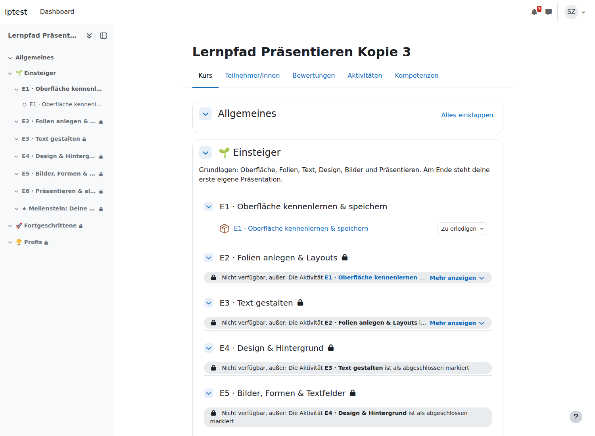
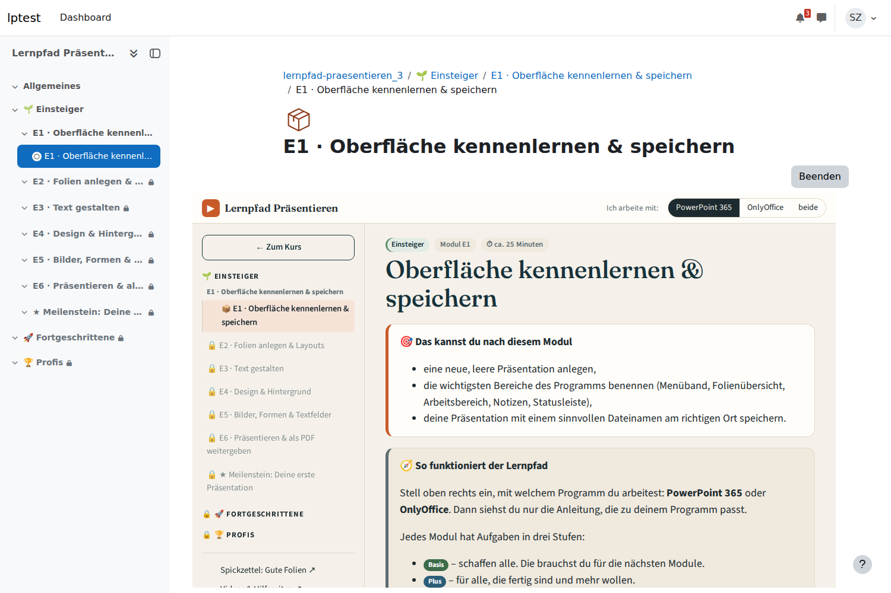
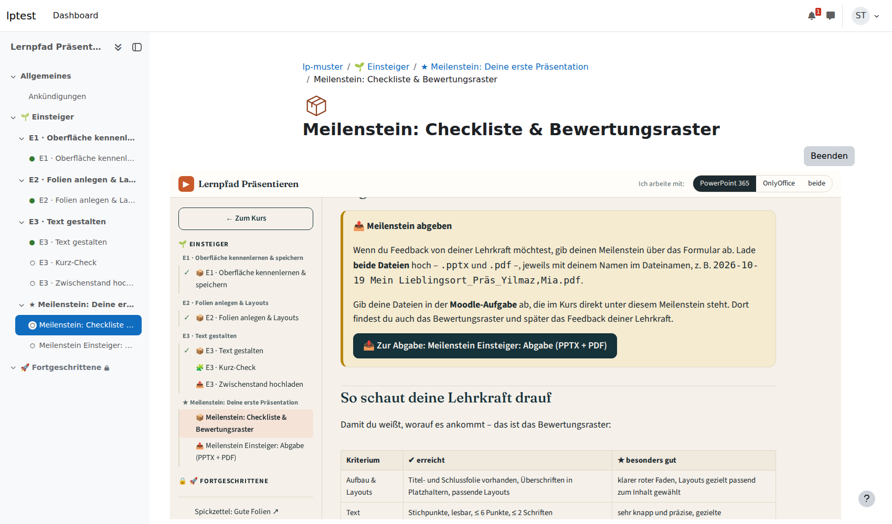

# Lernpfade in Moodle (Proof of Concept)

Die HTML-Lernpfade sollen in Moodle (5.x) laufen und dabei möglichst viel von ihrem Aussehen und ihrer Interaktivität behalten. **Moodle ist die Tür für die Schüler:innen.** Das HTML steckt als Lernpaket (SCORM) darin. Abgaben, Tests und H5P sind normale Moodle-Aktivitäten dazwischen.

| Was | Wofür | Dateien in `dist/` |
|---|---|---|
| **Kompletter Kurs** | Den ganzen Lernpfad Präsentieren mit einem Klick in einen Moodle-Kurs holen | `kurs/lernpfad-praesentieren.mbz` |
| **Lernpakete (SCORM)** | einzelne Module von Hand einbinden | `scorm/*.zip` |
| **Moodle-XML** | Aufgaben aus LF11c, Modul 1, für die Fragensammlung (Tests) | `moodle-xml/lf-11c_m1_fragen.xml` |
| **H5P** | Kurz-Checks als Selbstlern-Häppchen | `h5p/*.h5p` |

Alles wurde vorab in einem frischen **Moodle 5.2.3** (Deutsch) eingespielt und als Lehrkraft und Schüler:in durchgeklickt. Die Ergebnisse stehen jeweils unter „Vorab geprüft“.



---

## 1. Kompletter Kurs zum Wiederherstellen (empfohlen)

**Datei:** `dist/kurs/lernpfad-praesentieren.mbz` (ca. 5 MB)

Enthält den ganzen Lernpfad: drei Abschnitte (Einsteiger, Fortgeschrittene, Profis), darin je Modul ein **Unterabschnitt** mit dem Lernpaket. Dazu kommen:
- **Meilensteine:** Lernpaket mit Auftrag und Checkliste, dazu eine **Moodle-Aufgabe** mit Datei-Upload und **Bewertungsraster**. Das Raster wird automatisch aus der Tabelle auf der Meilenstein-Seite übernommen.
- **Beispiel E3:** zusätzlich ein **H5P-Kurz-Check** und eine **Zwischenabgabe** (Upload).
- **Freischaltung:** Jedes Modul wird frei, sobald das vorige als erledigt markiert ist. Die nächste Stufe wird frei, sobald der Meilenstein abgegeben ist.
- **Aktivitätsabschluss** ist überall eingestellt. In Aufgaben und H5P stehen Links „⬅️ Zurück / ➡️ Weiter im Lernpfad“, weil Moodle dort selbst kein „Weiter“ anzeigt.

### So geht's (als Lehrkraft, keine Admin-Rechte nötig)

1. Einen **leeren Kurs** nehmen oder anlegen lassen.
2. Kurs → **Mehr** → **Wiederverwendung** → **Wiederherstellen**.
3. `lernpfad-praesentieren.mbz` hochladen → **Wiederherstellen**.
4. Ziel: **„In diesen Kurs wiederherstellen“** mit
   - *„Kursinhalt löschen und dann wiederherstellen“* (für einen leeren Kurs am einfachsten) und
   - im nächsten Schritt **„Kurseinstellungen überschreiben: Ja“**. Dann ist die Abschlussverfolgung sicher an. Achtung: Dabei übernimmt Moodle auch den Kursnamen aus der Datei, den kann man danach wieder ändern.
5. Durchklicken bis **„Wiederherstellung durchführen“**.

> Wer lieber **„zusammenführen“** wählt oder die Kurseinstellungen nicht überschreibt: Vorher im Kurs unter *Einstellungen › Abschlussverfolgung* **„Abschlussverfolgung aktivieren: Ja“** setzen. Sonst greifen die Freischaltungen nicht. Bei vielen Moodles ist das ohnehin Standard.
>
> **H5P:** Der Kurz-Check in E3 bringt eigene H5P-Bibliotheken mit. Sind die Typen „Question Set“ und „Multiple Choice“ in eurem Moodle noch nicht installiert, muss sie der Admin einmal unter *Website-Administration › H5P* installieren (siehe Abschnitt 5).

### Navigation für die Schüler:innen

- Ein Klick auf ein Modul im Kurs öffnet das Lernpaket **direkt**, ohne Zwischenseite.
- Die **Seitenleiste im Lernpaket zeigt den ganzen Moodle-Kurs**: alle Abschnitte, Unterabschnitte und Aktivitäten, auch Aufgaben und H5P, mit ✓ für erledigt und 🔒 für gesperrt. Sie holt sich das live aus Moodle. Ändert die Lehrkraft den Kurs, passt sich die Leiste von selbst an.
- Unten steht **„← zurück / weiter →“** zur vorigen bzw. nächsten Moodle-Aktivität. Ist die nächste noch gesperrt, steht dort „🔒 … Wird frei, wenn du dieses Modul als erledigt markierst.“ Nach dem Klick auf „erledigt“ wird sie nach ein, zwei Sekunden freigeschaltet.
- Im Meilenstein-Paket führt ein Knopf **„📤 Zur Abgabe: …“** direkt in die Moodle-Aufgabe.
- Klappt das Auslesen des Kurses einmal nicht (z. B. nach einem großen Moodle-Update), zeigt das Paket einfach „Zurück zum Kurs“.



### Bitte testen

- [ ] Wiederherstellen als Lehrkraft in einen leeren Kurs
- [ ] Als Schüler:in: E1 öffnen → erledigt → „weiter“ → E2 … bis zum Kurz-Check und zur Zwischenabgabe in E3
- [ ] Meilenstein: „Zur Abgabe“ → Dateien hochladen → wird „Fortgeschrittene“ frei?
- [ ] Als Lehrkraft: Meilenstein-Abgabe mit dem Raster bewerten
- [ ] Handy / Moodle-App

### Vorab geprüft (Moodle 5.2.3)

- ✅ Wiederherstellen per Kommandozeile **und mit den Rechten einer normalen Lehrkraft**, sowohl „zusammenführen“ als auch „löschen und ersetzen“.
- ✅ Alle 21 Lernpakete startklar (Moodle entpackt sie beim Wiederherstellen selbst), 21 Unterabschnitte, 4 Aufgaben, 3 Raster mit je 6 Kriterien, H5P.
- ✅ Freischaltungen und die „Weiter“-Links zeigen nach dem Wiederherstellen auf die richtigen (neuen) Aktivitäten.
- ✅ Als Schülerin durchgespielt: direkter Start, Kursnavigation im Paket, Sperren, Freischalten nach „erledigt“, Weiter zu Kurz-Check und Aufgabe, Abgabe-Knopf im Meilenstein.
- ℹ️ Die Datei trägt die Version Moodle 5.0, damit sie in jedem Moodle ab 5.0 ohne Warnung läuft (Unterabschnitte gibt es erst ab 5.0).

---

## 2. Klickanleitung: Kurs von Hand bauen (Rückfallebene)

Falls das Wiederherstellen nicht passt, z. B. weil ein bestehender Kurs erweitert werden soll:

1. **Kurs-Einstellungen:** *Abschlussverfolgung aktivieren: Ja*.
2. **Abschnitte** für die Stufen anlegen (z. B. „🌱 Einsteiger“).
3. Im Abschnitt je Modul einen **Unterabschnitt** anlegen: *Aktivität oder Material anlegen* → **Unterabschnitt**, Name z. B. „E3 · Text gestalten“.
4. Im Unterabschnitt: *Aktivität anlegen* → **Lernpaket** (SCORM), Datei aus `dist/scorm/` hochladen. Einstellungen:

   | Bereich | Einstellung | Wert |
   |---|---|---|
   | Darstellung | Anzeige des Pakets | Aktuelles Fenster |
   | Darstellung | Inhaltsstruktur-Seite überspringen | **Immer** (öffnet das Paket ohne Zwischenseite) |
   | Darstellung | Inhaltsverzeichnis anzeigen | **Deaktiviert** |
   | Darstellung | Navigation anzeigen | Nein |
   | Bewertung | Bewertungsmethode / Maximum | Höchste Bewertung / 100 |
   | Versuche | Anzahl / Neuen Versuch erzwingen | Unbegrenzt / Nein |
   | Aktivitätsabschluss | Abschlussbedingung | **„Status erforderlich: Abgeschlossen“** |

5. **Optional** im selben Unterabschnitt: **H5P** (Kurz-Check, Abschluss „Bewertung erhalten“) und/oder **Aufgabe** (Dateiabgabe, Dateitypen z. B. `.pptx`, Abschluss „Abgabe erforderlich“). Beim Meilenstein unter *Bewertung* die Methode **„Bewertungsraster“** wählen und die Tabelle von der Meilenstein-Seite übernehmen.
6. **Freischaltung:** Unterabschnitt bearbeiten → *Voraussetzungen* → *Aktivitätsabschluss* → das Lernpaket des vorigen Moduls „muss abgeschlossen sein“. Für die nächste Stufe am Abschnitt: Meilenstein-Aufgabe „muss abgeschlossen sein“.

Die Navigation im Paket funktioniert bei einem von Hand gebauten Kurs genauso.

---

## 3. Lernpakete (SCORM) im Detail

**Dateien:** `dist/scorm/lernpfad-praesentieren_<modul>_scorm2004.zip` für alle 21 Module, dazu `lernpfad-praesentieren_e3_scorm12.zip` als Rückfalloption für SCORM 1.2.

- Fortschritt, Häkchen, Notizen, Kurz-Check-Antworten und „erledigt“ werden **in Moodle** gespeichert (nicht mehr nur im Browser).
- Die Programmwahl (PowerPoint/OnlyOffice) gilt für alle Module gemeinsam. Man stellt sie also nur einmal ein.
- Links auf andere Module innerhalb der Texte erscheinen als gepunktet unterstrichener Text. Die Navigation läuft über Seitenleiste und „weiter“.

### Vorab geprüft

- ✅ SCORM 2004 und 1.2 werden erkannt. Häkchen, Notiz (mit Umlauten), Kurz-Check, „erledigt“ und Programmwahl sind nach dem Wiederöffnen noch da.
- ✅ **Paket austauschen** (z. B. nach einer Korrektur): Der Fortschritt der Schüler:innen bleibt erhalten.
- ✅ Die Lehrkraft sieht im Bericht jede Kurz-Check-Antwort (Fragetext, gewählte und richtige Antwort), dazu Status und Punkte. In der Bewertung stehen Prozent (erster Versuch zählt).
- ℹ️ Nach dem Abschließen öffnet Moodle das Modul im **„Überprüfungsmodus“**. Das Etikett irritiert vielleicht, Änderungen werden aber trotzdem gespeichert (getestet).
- ℹ️ Bei SCORM 1.2 die *Bewertungsmethode* auf „Höchste Bewertung“ stellen, sonst zeigt Moodle 1 statt Prozent.



---

## 4. Moodle-XML (LF11c, Modul 1)

**Datei:** `dist/moodle-xml/lf-11c_m1_fragen.xml`: 43 Aufgaben, davon 2 Rechenaufgaben mit je 8 Zahlen-Varianten.

### So importieren

1. Kurs → *Mehr* → **Fragensammlungen** → Fragensammlung öffnen → **Import**.
2. Format **Moodle-XML**, *Allgemein:* „Kategorie aus Datei übernehmen“ **angehakt**.
3. Datei hochladen → Importieren → Weiter.

Danach gibt es die Kategorien `LF 11c › M1 Prozesse identifizieren und einordnen › 01 … 09` (je Lerneinheit, Reihenfolge wie im Lernpfad).

### Wie die Aufgabentypen übersetzt werden

| LF11c | Moodle | Hinweis |
|---|---|---|
| `single_choice` | Multiple-Choice, eine Antwort | Feedback je Option bleibt erhalten |
| `multiple_choice` | Multiple-Choice, mehrere Antworten | falsche Kreuze geben anteilig Abzug |
| `zuordnung` | Zuordnung | Das Feedback je Element steht gesammelt im allgemeinen Feedback (Moodle kann es nicht je Element) |
| `reihenfolge` | Anordnung | seit Moodle 4.4 Standard |
| `lueckentext` | Lückentext (Cloze) | Alle Schreibweisen sind hinterlegt, auch Leerzeichen statt Bindestrich. Groß/klein ist egal, der Hinweis erscheint bei falscher Antwort. |
| `zahl` | Lückentext mit Zahlenfeldern | Aufgaben **mit Parametern** landen als 8 Varianten in einer eigenen Unterkategorie „… (Varianten)“. Im Test dann eine **Zufallsfrage aus dieser Kategorie** einfügen, dann bekommt jede:r andere Zahlen. Der Lösungsweg mit den passenden Zahlen erscheint im Feedback. |
| `offen` | Freitext | Musterlösung und Checkliste stehen als Bewertungshinweis für die Lehrkraft **und** im Feedback nach dem Test (Selbstkontrolle wie im Lernpfad) |

Die Aufgaben-IDs (`m1-a01` …) werden zur Moodle-**ID-Nummer**. Die Tags `niveau-1/2/3`, der Typ und der Review-Status (`entwurf`) helfen beim Filtern.

### Bitte testen

- [ ] Import läuft ohne Fehler
- [ ] Einen Test anlegen mit ein paar Fragen und einer **Zufallsfrage** aus `m1-a17 … (Varianten)`
- [ ] Als Schüler:in durchspielen. Sieht es gut aus (Tabellen, Fettdruck, Feedback)?
- [ ] Rechenaufgabe mit Komma **und** mit Punkt eingeben

### Vorab geprüft

- ✅ Import ohne Fehler, alle 43 Aufgaben (plus 16 Zahlen-Varianten) in 5 Moodle-Fragetypen.
- ✅ Mit Moodles Bewertungs-Engine nachgerechnet: Lückentext akzeptiert „ist aufnahme“ (klein, Leerzeichen) und „Istanalyse“. Rechenaufgaben akzeptieren **Komma und Punkt**. Die Reihenfolge wird richtig bzw. falsch erkannt.
- ✅ Listen, Tabellen und Fettdruck werden dargestellt, Musterlösung und Checkliste erscheinen im Feedback.


---

## 5. H5P

**Dateien:**
- `dist/h5p/lernpfad-praesentieren_e1_kurzcheck.h5p` … `_e6_…`: die Kurz-Checks der Module als Question Set. Jede falsche Antwort bekommt das Feedback aus dem Lernpfad.
- `dist/h5p/m1-a14_lueckentext.h5p`: LF11c-Lückentext „Vom Ist zum Soll“ als Fill in the Blanks. Tipps erscheinen als Hinweis-Symbol, Groß/klein ist egal.

Alle Texte der Oberfläche („Überprüfen“, „Lösung anzeigen“ …) sind auf Deutsch.

### So anlegen

Kurs → *Aktivität anlegen* → **H5P** → Datei hochladen. Bei der Bewertung „Höchste Bewertung“ oder „Letzter Versuch“ wählen.

> **Wichtig (einmalig für den Admin):** Die Pakete bringen ihre H5P-Bibliotheken mit. Neue Bibliotheken darf in Moodle aber nur installieren, wer das Recht *moodle/h5p:updatelibraries* hat, also standardmäßig nur Admins und Manager. Also entweder lädt der Admin das erste Paket jedes Typs einmal hoch, oder er installiert unter *Website-Administration › H5P › H5P-Inhaltstypen verwalten* die Typen „Question Set“ und „Fill in the Blanks“. Danach können Lehrkräfte alle weiteren Pakete selbst hochladen.

### Bitte testen

- [ ] Hochladen als Admin, danach als Lehrkraft
- [ ] Durchspielen als Schüler:in, Punkte in der Bewertungsübersicht?
- [ ] Wie wirkt das neben dem SCORM-Modul: sinnvolle Ergänzung oder doppelt?

### Vorab geprüft

- ✅ Pakete lassen sich hochladen, alle Knöpfe und Meldungen sind auf Deutsch.
- ✅ Durchgespielt: Das Feedback aus dem Lernpfad erscheint an der richtigen Stelle, die Versuche landen in Moodle (Kurz-Check 1/2, Lückentext 3/3).
- ✅ Sind die Bibliotheken einmal installiert, kann eine **Lehrkraft ohne Admin-Rechte** weitere Pakete selbst anlegen.


---

## Werkzeuge (`tools/`)

Alle Skripte laufen mit Python 3 und brauchen `pyyaml` und `markdown-it-py` (`pip install pyyaml markdown-it-py`). `build_h5p.py` lädt beim ersten Lauf die H5P-Bibliotheken vom offiziellen H5P-Hub (Zwischenspeicher: `moodle-poc/.cache/`).

```bash
# Lernpakete (im Wurzelordner des Lernpfads Präsentieren)
python3 moodle-poc/tools/build_scorm.py                     # alle Module, SCORM 2004
python3 moodle-poc/tools/build_scorm.py e3 --scorm 1.2      # SCORM 1.2

# Kompletter Kurs aus der Kursbeschreibung
python3 moodle-poc/tools/build_moodle_kurs.py moodle-poc/kurs/praesentieren.yaml

# Moodle-XML aus einem Lernpfad im LF11c-Schema
python3 moodle-poc/tools/lf11c_to_moodlexml.py ../lernpfad-lf11c m1

# H5P
python3 moodle-poc/tools/build_h5p.py kurzcheck e1 e2 e3
python3 moodle-poc/tools/build_h5p.py lueckentext ../lernpfad-lf11c m1-a14
```

**Kursbeschreibung** (`kurs/praesentieren.yaml`): Hier steht, welche Einheiten es gibt, wo Zwischenabgaben und H5P hinkommen, welches Raster gilt und wie freigeschaltet wird. Die Datei ist kommentiert. Genau diese Entscheidungen soll die Lehrkraft später im Skill zusammen mit Claude treffen, danach baut das Skript den Kurs.

Die SCORM-Anbindung steckt in `assets/js/scorm.js` (nur im Paket eingebunden: Speichern in Moodle, Kursnavigation) und in ein paar Haken in `assets/js/app.js`. Die Web-Version (GitHub Pages) verhält sich unverändert.
