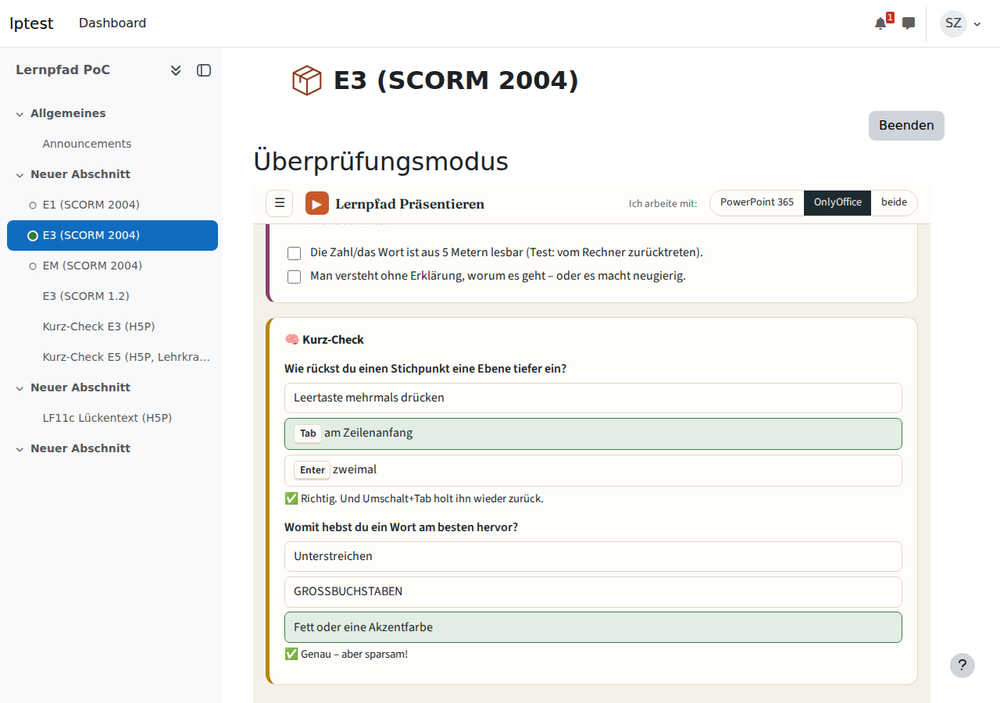
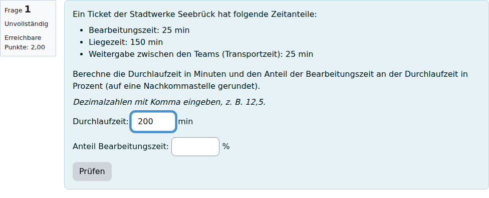
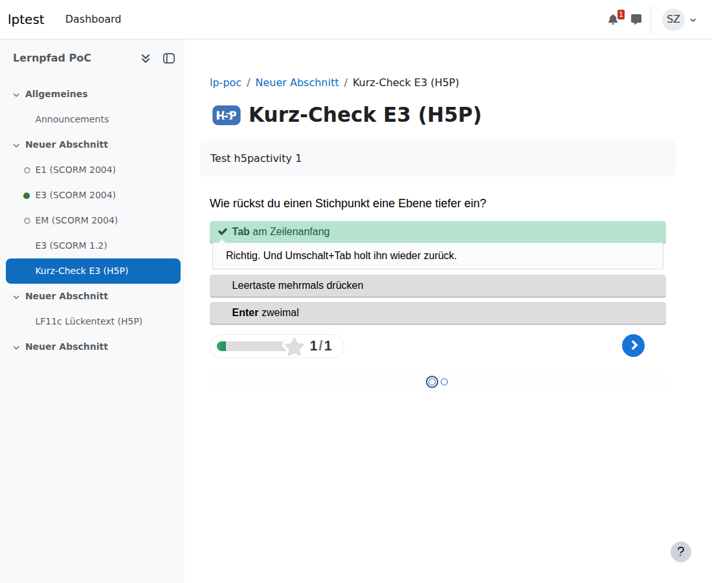

# Moodle-Proof-of-Concept

Hier wird getestet, ob sich die HTML-Lernpfade gut in Moodle (5.x) einbinden lassen. Dabei soll möglichst viel vom Aussehen und von der Interaktivität erhalten bleiben. Drei Wege werden ausprobiert:

| Weg | Was | Dateien in `dist/` |
|---|---|---|
| **SCORM** | Modulseiten des Lernpfads Präsentieren als SCORM-Paket. Fortschritt, Häkchen, Notizen und Kurz-Check-Antworten landen in Moodle. | `scorm/*.zip` |
| **Moodle-XML** | Alle Aufgaben aus LF11c, Modul 1 (7 Aufgabentypen) als Fragen für die Fragensammlung | `moodle-xml/lf-11c_m1_fragen.xml` |
| **H5P** | Kurz-Checks E1–E6 als „Question Set“, ein LF11c-Lückentext als „Fill in the Blanks“ | `h5p/*.h5p` |

Alles wurde vorab in einem frischen **Moodle 5.2.3** (Sprache Deutsch) importiert und durchgeklickt. Die Ergebnisse stehen jeweils unten unter „Vorab geprüft“.

---

## 1. SCORM-Pakete (Lernpfad Präsentieren, Stufe Einsteiger)

**Dateien:** `dist/scorm/lernpfad-praesentieren_e1_scorm2004.zip` … `_e6_…`, `_em_…` (Meilenstein) sowie `lernpfad-praesentieren_e3_scorm12.zip` als Rückfalloption für SCORM 1.2.

### So anlegen

1. Im Kurs: *Aktivität oder Material anlegen* → **SCORM-Paket**.
2. Name z. B. „E3 · Text gestalten“, Paketdatei hochladen.
3. Empfohlene Einstellungen:
   - *Darstellung → Anzeige des Pakets:* **Aktuelles Fenster**. Alternativ „Neues Fenster“ ausprobieren.
   - *Darstellung:* „Inhaltsverzeichnis“ **ausblenden**, „Navigation anzeigen“ **nein**. Das Paket hat eine eigene Navigation.
   - *Bewertung:* Bewertungsmethode **Höchste Bewertung**, Maximale Bewertung 100. Die Punkte kommen aus dem Kurz-Check, gezählt wird jeweils der erste Versuch.
   - *Versuchsverwaltung:* Anzahl der Versuche **unbegrenzt**, „Neuen Versuch erzwingen“ **Nein**. So bleibt der Stand beim Wiederkommen erhalten.
   - *Aktivitätsabschluss:* **„Status erforderlich: Abgeschlossen“**. Das Modul gilt als erledigt, sobald die Schülerin oder der Schüler auf „Modul als erledigt markieren“ klickt.
4. Für den Meilenstein (`_em_`) daneben eine **Aufgabe** anlegen (Abgabe PPTX + PDF). Das Bewertungsraster steht auf der Meilenstein-Seite und kann als Bewertungsrichtlinie übernommen werden. Im Paket verweist der Abgabe-Kasten automatisch auf die Moodle-Aufgabe statt auf das Nextcloud-Formular.
5. Tipp für die Reihenfolge: Mit *Voraussetzungen* („E2 abgeschlossen“ → E3 wird sichtbar) entsteht der Pfad.

### Was im Paket anders ist als in der Web-Version

- Die Seitenleiste zeigt nur das aktuelle Modul, dazu Spickzettel und Videos (öffnen sich im neuen Tab).
- Links auf andere Module erscheinen als gepunktet unterstrichener Text („findest du im Moodle-Kurs“).
- Statt „weiter/zurück“ gibt es den Hinweis, zurück in den Kurs zu gehen.
- Die Programmwahl (PowerPoint/OnlyOffice) wird für alle Module gemeinsam gemerkt. Man stellt sie also nur einmal ein.

### Bitte testen

- [ ] Paket lässt sich hochladen, Seite sieht aus wie die Web-Version (Schriften, Farben, Menüband-Grafiken)
- [ ] Umschalter PowerPoint/OnlyOffice funktioniert
- [ ] Als Schüler:in: Häkchen setzen, Notiz schreiben, Kurz-Check beantworten → Kurs verlassen → wieder öffnen: **alles noch da?**
- [ ] Als Lehrkraft: *Berichte* des SCORM-Pakets → Versuch anklicken → Antworten der Kurz-Checks (Interaktionen), Punkte, Status sichtbar?
- [ ] „Modul als erledigt markieren“ → Häkchen beim Aktivitätsabschluss im Kurs?
- [ ] Handy / Moodle-App: bedienbar?
- [ ] Übungsdatei (E3: `e3-textwueste.pptx`) lässt sich herunterladen
- [ ] Anzeige im **neuen Fenster** statt im aktuellen – was fühlt sich besser an?

### Vorab geprüft (Moodle 5.2.3, Deutsch)

- ✅ Beide SCORM-Versionen (2004 und 1.2) werden erkannt. Häkchen, Notiz (mit Umlauten), Kurz-Check, „erledigt“ und die Programmwahl sind nach dem Wiederöffnen noch da.
- ✅ **Paket austauschen** (z. B. nach einer Korrektur): Der Fortschritt der Schüler:innen bleibt erhalten.
- ✅ Die Lehrkraft sieht im Bericht jede Kurz-Check-Antwort (Fragetext, gewählte und richtige Antwort, richtig/falsch), dazu Status und Punkte. In der Bewertungsübersicht stehen Prozent (erster Versuch zählt).
- ✅ Aktivitätsabschluss wird gesetzt, sobald „Modul als erledigt markieren“ geklickt wird.
- ✅ Meilenstein: Der Abgabe-Kasten verweist auf die Moodle-Aufgabe, und es gibt keine toten Links auf andere Module mehr.
- ℹ️ Nach dem Abschließen öffnet Moodle das Modul im **„Überprüfungsmodus“**. Das Etikett irritiert vielleicht, aber Änderungen werden trotzdem gespeichert (getestet).
- ℹ️ Bei SCORM 1.2 die *Bewertungsmethode* auf „Höchste Bewertung“ stellen, sonst zählt Moodle nur „Lernobjekte“ (Note 1 statt Prozent).
- ⬜ Nicht geprüft: Moodle-App, Handy, Anzeige im neuen Fenster.



---

## 2. Moodle-XML (LF11c, Modul 1)

**Datei:** `dist/moodle-xml/lf-11c_m1_fragen.xml`: 43 Aufgaben, davon 2 Rechenaufgaben mit je 8 Zahlen-Varianten.

### So importieren

1. Kurs → *Mehr* → **Fragensammlungen** → Fragensammlung öffnen → **Import**.
2. Format **Moodle-XML**, *Allgemein:* „Kategorie aus Datei übernehmen“ **angehakt**.
3. Datei hochladen → Importieren → Weiter.

Danach gibt es die Kategorien `LF 11c › M1 Prozesse identifizieren und einordnen › 01 … 09` (je Lerneinheit, Reihenfolge wie im Lernpfad).

### Wie die Aufgabentypen übersetzt werden

| LF11c | Moodle | Hinweis |
|---|---|---|
| `single_choice` | Multiple-Choice, eine Antwort | Feedback je Option bleibt erhalten |
| `multiple_choice` | Multiple-Choice, mehrere Antworten | falsche Kreuze geben anteilig Abzug |
| `zuordnung` | Zuordnung | Das Feedback je Element steht gesammelt im allgemeinen Feedback (Moodle kann es nicht je Element) |
| `reihenfolge` | Anordnung | seit Moodle 4.4 Standard |
| `lueckentext` | Lückentext (Cloze) | Alle Schreibweisen sind hinterlegt, auch Leerzeichen statt Bindestrich. Groß/klein ist egal, der Hinweis erscheint bei falscher Antwort. |
| `zahl` | Lückentext mit Zahlenfeldern | Aufgaben **mit Parametern** landen als 8 Varianten in einer eigenen Unterkategorie „… (Varianten)“. Im Test dann eine **Zufallsfrage aus dieser Kategorie** einfügen, dann bekommt jede:r andere Zahlen. Der Lösungsweg mit den passenden Zahlen erscheint im Feedback. |
| `offen` | Freitext | Musterlösung und Checkliste stehen als Bewertungshinweis für die Lehrkraft **und** im Feedback nach dem Test (Selbstkontrolle wie im Lernpfad) |

Die Aufgaben-IDs (`m1-a01` …) werden zur Moodle-**ID-Nummer**. Die Tags `niveau-1/2/3`, der Typ und der Review-Status (`entwurf`) helfen beim Filtern.

### Bitte testen

- [ ] Import läuft ohne Fehler
- [ ] Einen Test anlegen mit ein paar Fragen und einer **Zufallsfrage** aus `m1-a17 … (Varianten)`
- [ ] Als Schüler:in durchspielen. Sieht es gut aus (Tabellen, Fettdruck, Feedback)?
- [ ] Rechenaufgabe mit Komma **und** mit Punkt eingeben

### Vorab geprüft

- ✅ Import ohne Fehler, alle 43 Aufgaben (plus 16 Zahlen-Varianten) in 5 Moodle-Fragetypen.
- ✅ Mit Moodles Bewertungs-Engine nachgerechnet: Lückentext akzeptiert „ist aufnahme“ (klein, Leerzeichen) und „Istanalyse“. Rechenaufgaben akzeptieren **Komma und Punkt**. Die Reihenfolge wird richtig bzw. falsch erkannt.
- ✅ Listen, Tabellen und Fettdruck werden dargestellt, Musterlösung und Checkliste erscheinen im Feedback.



---

## 3. H5P

**Dateien:**
- `dist/h5p/lernpfad-praesentieren_e1_kurzcheck.h5p` … `_e6_…`: die Kurz-Checks der Module als Question Set. Jede falsche Antwort bekommt das Feedback aus dem Lernpfad.
- `dist/h5p/m1-a14_lueckentext.h5p`: LF11c-Lückentext „Vom Ist zum Soll“ als Fill in the Blanks. Tipps erscheinen als Hinweis-Symbol, Groß/klein ist egal.

Alle Texte der Oberfläche („Überprüfen“, „Lösung anzeigen“ …) sind auf Deutsch.

### So anlegen

Kurs → *Aktivität anlegen* → **H5P** → Datei hochladen. Bei der Bewertung „Höchste Bewertung“ oder „Letzter Versuch“ wählen.

> **Wichtig (einmalig für den Admin):** Die Pakete bringen ihre H5P-Bibliotheken mit. Neue Bibliotheken darf in Moodle aber nur installieren, wer das Recht *moodle/h5p:updatelibraries* hat, also standardmäßig nur Admins und Manager. Also entweder lädt der Admin das erste Paket jedes Typs einmal hoch, oder er installiert unter *Website-Administration › H5P › H5P-Inhaltstypen verwalten* die Typen „Question Set“ und „Fill in the Blanks“. Danach können Lehrkräfte alle weiteren Pakete selbst hochladen.

### Bitte testen

- [ ] Hochladen als Admin, danach als Lehrkraft
- [ ] Durchspielen als Schüler:in, Punkte in der Bewertungsübersicht?
- [ ] Wie wirkt das neben dem SCORM-Modul: sinnvolle Ergänzung oder doppelt?

### Vorab geprüft

- ✅ Pakete lassen sich hochladen, alle Knöpfe und Meldungen sind auf Deutsch.
- ✅ Durchgespielt: Das Feedback aus dem Lernpfad erscheint an der richtigen Stelle, die Versuche landen in Moodle (Kurz-Check 1/2, Lückentext 3/3).
- ✅ Sind die Bibliotheken einmal installiert, kann eine **Lehrkraft ohne Admin-Rechte** weitere Pakete selbst anlegen.



---

## Werkzeuge (`tools/`)

Alle Skripte laufen mit Python 3 und brauchen `pyyaml` und `markdown-it-py` (`pip install pyyaml markdown-it-py`). `build_h5p.py` lädt beim ersten Lauf die H5P-Bibliotheken vom offiziellen H5P-Hub (Zwischenspeicher: `moodle-poc/.cache/`).

```bash
# SCORM-Pakete (im Wurzelordner des Lernpfads Präsentieren)
python3 moodle-poc/tools/build_scorm.py e1 e2 e3            # SCORM 2004
python3 moodle-poc/tools/build_scorm.py e3 --scorm 1.2      # SCORM 1.2

# Moodle-XML aus einem Lernpfad im LF11c-Schema
python3 moodle-poc/tools/lf11c_to_moodlexml.py ../lernpfad-lf11c m1

# H5P
python3 moodle-poc/tools/build_h5p.py kurzcheck e1 e2 e3
python3 moodle-poc/tools/build_h5p.py lueckentext ../lernpfad-lf11c m1-a14
```

Die SCORM-Anbindung steckt in `assets/js/scorm.js` (nur im Paket eingebunden) und in ein paar Haken in `assets/js/app.js`. Die Web-Version (GitHub Pages) verhält sich unverändert.
